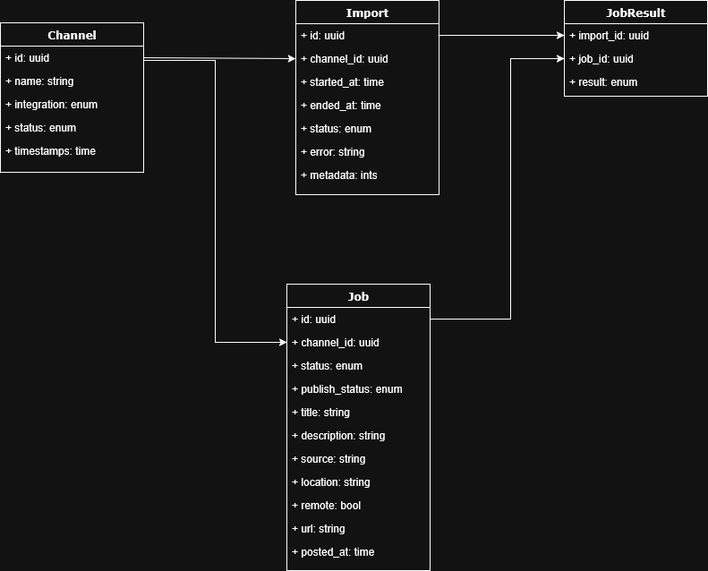
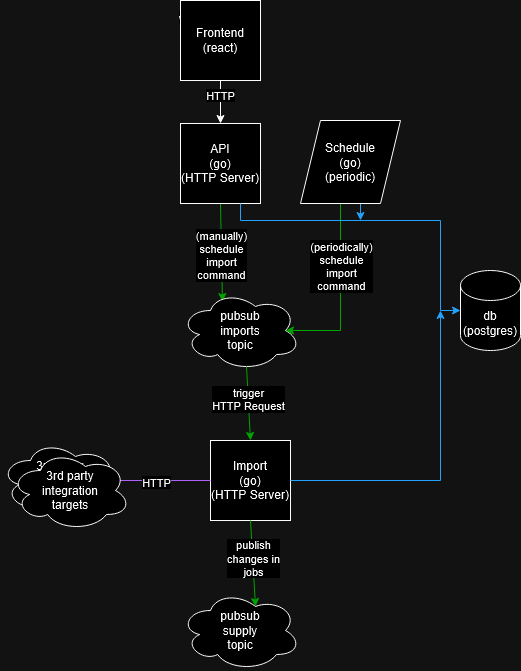

# Jobs project

## Description
This web application integrates with multiple Job Board APIs to
aggregate and import job offers into the organization's centralized job supply.

## Dependencies
The project has two dependencies:
- postgres: The database.
- pubsub: The message broker.

Both are started by running the following command:
```bash
docker-compose up -d
```

## Local run

### 1. Go binaries
The project has 3 go binaries:
- `api`: The backend to the backoffice. (http://localhost:8080)
- `import`: The binary that executes the imports from the job boards, triggered by a HTTP API call. (http://localhost:8081)
- `schedule`: A job that schedules imports of active channels to run.

### 2. Frontend
The frontend of the backoffice is a React application ((http://localhost:3000).
To start the frontend, you need to run the following command:
```bash
cd frontend
npm install
npm run dev
```

### 3. Postman
The project has a Postman collection that can be used to interact with the API in localhost.
The collection can be downloaded [Here](docs/jobs%20-%20API.postman_collection.json).


## Architecture

### Entities


### Dependency Map

